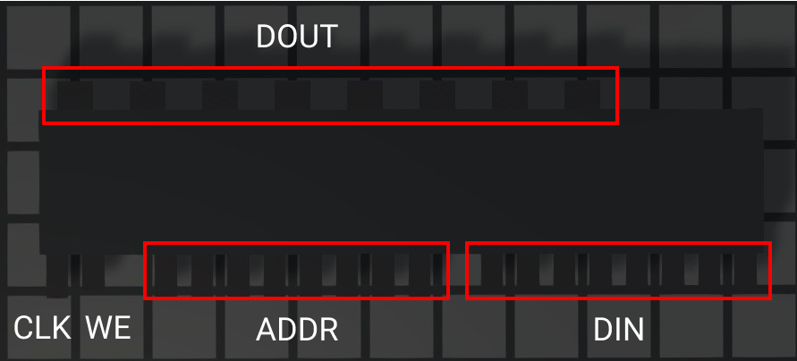

# Potato Chips

A set of fun and useful utilities for [Logic World](https://logicworld.net)

## Disclaimer

Most of these mods should work on fine, even on servers. However, things break and when they do feel free to [open a ticket](/issues) and I'll try to fix it.

## Installation

All you need to do is download or clone the repo and add it under the `GameData` folder of your Logic World game files.

# Modules

## D Flip Flop

This is a simple chip that acts just like a D Latch except that it triggers on the edge of a clock signal.

**Pins (Top Right to Bottom Left):**
| Pin    | Function | Type |
|--------|----------|------|
| `DIN`  | Data In  | IN   |
| `CLK`  | Clock    | IN   |
| `DOUT` | Data Out | OUT  |

## Hex Display

A 7-segment display driver inspired by the video by [Ben Eater](https://www.youtube.com/watch?v=7zffjsXqATg). The 4 input lines correspond to a 4-bit value with the MSB on the left.

| Pin   | Function  | Type |
|-------|-----------|------|
| `G-A` | Sgmnt G-A | OUT  |
| `DIN` | Data In   | IN   |

## Mem8

This is an 8-bit RAM module with 8-bit address and data lines.

*Note: All lines are MSB on the left.*

| Pin    | Function | Type |
|--------|----------|------|
| `DOUT` | Data Out | OUT  |
| `CLK`  | Clock    | IN   |
| `ADDR` | Addr In  | IN   |
| `DIN`  | Data In  | IN   |

## Shift Register

A simple 4-bit shift register with a clock signal, serial in, and 4-bit parallel out. This chip reacts to rising-edge of the clock pin.

| Pin    | Function     | Type |
|--------|--------------|------|
| `POUT` | Parallel Out | OUT  |
| `DIN`  | Serial In    | IN   |
| `CLK`  | Clock        | IN   |

